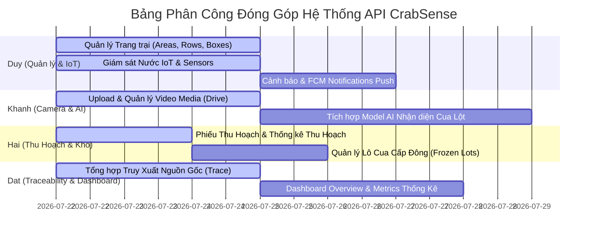

# Báo Cáo Phân Công & Kiểm Tra Trạng Thái API Theo Nhiệm Vụ Thành Viên (CrabSense)

**Thời gian cập nhật:** 2026-07-23  
**Backend Host:** `http://103.69.96.143:5080` (Swagger v1)  
**Tệp cấu hình Mobile:** `lib/core/constants/api_constants.dart`  
**Mã nguồn Backend:** `d:\CrabSense\CrabSenseBE` (C# .NET 8 Web API)

---

## 📊 Ký hiệu trạng thái API
- ✅ **Đã có trên Backend & Khớp Swagger:** Backend đã triển khai Endpoint chuẩn và Mobile App đã được gắn tương ứng trong `ApiConstants.dart`.
- ⚠️ **Stub / Cần thêm logic Backend:** Backend đã khai báo Endpoint nhưng đang trả về dữ liệu mẫu (Stub) hoặc chưa kết nối dữ liệu/event thật.
- ❌ **Thiếu / Chưa triển khai:** Backend chưa có Endpoint này hoặc Endpoint đang bị comment out trong source code Backend.

---

## 🔒 HỆ THỐNG PHÂN QUYỀN (ROLES) TRÊN BACKEND

Tất cả API Backend trả về định dạng JSON chuẩn:
```json
{
  "success": true,
  "message": "Thông báo (null nếu không có lỗi)",
  "data": { ... }
}
```

Các vai trò (Role) được định nghĩa trong `AppRoles`:
- **`[AllowAnonymous]`**: Truy cập tự do không cần Token JWT.
- **`[Authorize]` (Role: Any)**: Yêu cầu JWT hợp lệ của bất kỳ Role nào (`SystemAdmin`, `FarmOwner`, `Staff`).
- **`FarmWrite`**: Yêu cầu Role thuộc `SystemAdmin`, `FarmOwner`, hoặc `Staff` (Các thao tác ghi/sửa dữ liệu vận hành).
- **`FarmManage`**: Yêu cầu Role thuộc `SystemAdmin` hoặc `FarmOwner` (Quản trị/xóa cấu trúc trang trại).
- **`Platform` / `SystemAdmin`**: Chỉ dành riêng cho Admin hệ thống.

---

## 👤 1. DUY — (Phần 1, 2, 3: Quản Lý Trang Trại, Môi Trường & Cảnh Báo)

### 1. Quản lý trang trại cua lột

| STT | Chức năng chi tiết | Endpoint Mobile (`ApiConstants`) | Endpoint Backend Swagger | Yêu cầu Role | Trạng thái | Ghi chú & Cấu trúc JSON trả về |
| :---: | :--- | :--- | :--- | :---: | :---: | :--- |
| 1.1 | Quản lý khu nuôi | `/api/farming-areas` | `GET/POST/PUT/DELETE /api/farming-areas`<br>`GET/POST /api/farming-areas/{id}/rows` | `[Authorize]` / `FarmWrite` / `FarmManage` | ✅ | Trả về `ApiResponse<PagedResult<FarmingAreaDto>>` hoặc `ApiResponse<FarmingAreaDto>` |
| 1.2 | Quản lý dãy nuôi | `/api/farming-rows` | `GET/POST/PUT/DELETE /api/farming-rows`<br>`GET/POST /api/farming-rows/{id}/boxes` | `[Authorize]` / `FarmWrite` / `FarmManage` | ✅ | Trả về `ApiResponse<PagedResult<FarmingRowDto>>` |
| 1.3 | Quản lý Crab Farm Box | `/api/boxes`<br>`/api/boxes/available`<br>`/api/boxes/overview` | `GET/POST/PUT/DELETE /api/boxes`<br>`PATCH /api/boxes/{id}/status`<br>`GET /api/boxes/available`<br>`GET /api/boxes/overview` | `[Authorize]` / `FarmWrite` / `FarmManage` | ✅ | **`GET /api/boxes/overview`** — payload Boxes tab (health, water, devices, alerts, AI, map layout). Mobile đã nối, bỏ mock enrichment. |
| 1.4 | Quản lý cua, lô cua & vụ nuôi | `/api/crabs`<br>`/api/crab-lots`<br>`/api/crop-batches` | `GET/POST/PUT/DELETE /api/crabs`<br>`GET/POST/PUT/DELETE /api/crab-lots`<br>*`/api/crop-batches` (Commented out)* | `[Authorize]` / `FarmWrite` | ⚠️ | Backend đã có Cua (`/api/crabs`) & Lô cua (`/api/crab-lots`). **Vụ nuôi (`/api/crop-batches`) đang bị khóa/comment out trong Backend.** |
| 1.5 | Phân bổ / Chuyển box | `/api/allocations`<br>`/api/box-qr/{code}/move-crab` | `POST/PUT/DELETE /api/allocations`<br>`POST /api/box-qr/{code}/move-crab` | `FarmWrite` | ✅ | Trả về `ApiResponse<CrabAllocationDto>` hoặc `ApiResponse<BoxQrScanResultDto>` |
| 1.6 | Theo dõi trạng thái box | `/api/boxes/{boxId}`<br>`/api/boxes/{boxId}/status` | `GET /api/boxes/{boxId}`<br>`PATCH /api/boxes/{boxId}/status` | `[Authorize]` / `FarmWrite` | ✅ | Trả về `ApiResponse<BoxDto>` |
| 1.7 | Lịch sử nuôi & lột xác | `/api/crabs/{crabId}/moltings`<br>`/api/boxes/{boxId}/farming-timeline` | `POST/GET/PUT/DELETE /api/crabs/{crabId}/moltings`<br>`GET /api/boxes/{boxId}/farming-timeline` | `[Authorize]` / `FarmWrite` | ✅ | Trả về `ApiResponse<List<MoltingRecordDto>>` & `ApiResponse<BoxFarmingTimelineDto>` |

### 2. Giám sát môi trường nuôi

| STT | Chức năng chi tiết | Endpoint Mobile (`ApiConstants`) | Endpoint Backend Swagger | Yêu cầu Role | Trạng thái | Ghi chú & Cấu trúc JSON trả về |
| :---: | :--- | :--- | :--- | :---: | :---: | :--- |
| 2.1 | Dữ liệu thời gian thực (Nhiệt độ, pH, Độ mặn, DO, Mực nước) | `/api/iot/live` | `GET /api/iot/live` | `[Authorize]` (Any) | ✅ | Trả về `ApiResponse<LiveIotSnapshotDto>` chứa danh sách thiết bị và thông số mới nhất |
| 2.2 | Biểu đồ lịch sử môi trường | `/api/iot/sensor-data/{sensorId}` | `GET /api/iot/sensor-data/{sensorId}`<br>`GET /api/iot/sensor-data/{sensorId}/latest` | `[Authorize]` (Any) | ✅ | Trả về `ApiResponse<PagedResult<SensorDataDto>>` hỗ trợ lọc theo mốc thời gian |
| 2.3 | Quản lý thiết bị & Cảm biến | `/api/sensors`<br>`/api/devices`<br>`/api/water-systems` | `GET/POST/PUT/DELETE /api/sensors`<br>`GET/POST/PUT/DELETE /api/devices`<br>`GET/POST/PUT/DELETE /api/water-systems` | `[Authorize]` / `FarmWrite` | ✅ | Backend có đầy đủ API quản lý Cảm biến, Hệ thống nước & Cổng kết nối ESP32 |

### 3. Cảnh báo thông minh & Thông báo Mobile

| STT | Chức năng chi tiết | Endpoint Mobile (`ApiConstants`) | Endpoint Backend Swagger | Yêu cầu Role | Trạng thái | Ghi chú & Hướng xử lý |
| :---: | :--- | :--- | :--- | :---: | :---: | :--- |
| 3.1 | Cảnh báo thông số vượt ngưỡng | `/api/alerts` | `GET /api/alerts`<br>`PATCH /api/alerts/{id}/acknowledge`<br>`PATCH /api/alerts/{id}/resolve` | `[Authorize]` / `FarmWrite` | ✅ | Backend đã có đầy đủ API danh sách Cảnh báo & Xác nhận/Giải quyết |
| 3.2 | Cấu hình ngưỡng cảnh báo | `/api/alert-thresholds` | `GET/POST/PUT/DELETE /api/alert-thresholds` | `[Authorize]` / `FarmWrite` | ✅ | Trả về `ApiResponse<List<AlertThresholdDto>>` |
| 3.3 | Cảnh báo mất kết nối cảm biến/camera | `/api/alerts/check-disconnects` | `POST /api/alerts/check-disconnects` | `FarmWrite` | ✅ | Backend đã có API kích hoạt quét thiết bị/cảm biến mất kết nối |
| 3.4 | Gửi thông báo Push Mobile (FCM Token) | `/api/notifications/register`<br>`/api/v1/notifications/register` | `POST/DELETE/GET /api/notifications/register`<br>`POST/DELETE /api/v1/notifications/register` | `[Authorize]` (Any) | ✅ | **Backend ĐÃ CÓ** API Đăng ký & Hủy đăng ký Push Token (Cả `NotificationsController` & `NotificationsV1Controller`) |
| 3.5 | Tích hợp Telegram / Zalo & Settings | `/api/notifications/settings`<br>`/api/notifications/channels` | `GET/PUT /api/notifications/settings`<br>`GET/POST/PUT/DELETE /api/notifications/channels` | `FarmWrite` | ✅ | **Backend ĐÃ CÓ** API quản lý kênh Telegram/Zalo, gửi thử nghiệm (`test`) và cập nhật Settings |
| 3.6 | Lịch sử & Số lượng chưa đọc | `/api/alerts/history`<br>`/api/alerts/unread/count` | *Chưa có* | - | ❌ | Backend **THIẾU** Endpoint đếm số cảnh báo chưa đọc và lấy lịch sử cảnh báo phân trang |

---

## 👤 2. KHANH — (Phần 4, 5: Giám Sát Hình Ảnh & Nhận Diện AI)

### 4. Giám sát hình ảnh

| STT | Chức năng chi tiết | Endpoint Mobile (`ApiConstants`) | Endpoint Backend Swagger | Yêu cầu Role | Trạng thái | Ghi chú & Hướng xử lý |
| :---: | :--- | :--- | :--- | :---: | :---: | :--- |
| 4.1 | Thu thập ảnh/video từ camera | `/api/media/upload` | `POST /api/media/upload` | `FarmWrite` | ✅ | Upload trực tiếp lên Google Drive. Trả về `ApiResponse<MediaFileDto>` chứa Drive File ID & URL xem |
| 4.2 | Lưu trữ & tra cứu hình ảnh theo thời gian | `/api/media` | `GET/DELETE /api/media`<br>`GET /api/media/{id}`<br>`POST /api/media/{id}/share` | `[Authorize]` / `FarmManage` | ✅ | Hỗ trợ lọc theo `category`, `boxId`, `crabId` |
| 4.3 | Lịch quay video dự kiến | `/api/videos/schedule` | *Chưa có* | - | ❌ | Backend **THIẾU** API danh sách box đến lịch quay video |
| 4.4 | Xem video theo Hộp nuôi | `/api/boxes/{boxId}/videos` | *Chưa có (Dùng tạm `GET /api/media?boxId=...`)* | - | ❌ | Backend **THIẾU** Endpoint riêng `/api/boxes/{boxId}/videos` |
| 4.5 | Theo dõi trạng thái cua từ hình ảnh | `/api/ai/detections` | `GET /api/ai/detections` | `[Authorize]` | ⚠️ | Backend đang ở dạng **Stub** dữ liệu mẫu (`AiController.cs`) |

### 5. Phát hiện cua lột bằng AI

| STT | Chức năng chi tiết | Endpoint Mobile (`ApiConstants`) | Endpoint Backend Swagger | Yêu cầu Role | Trạng thái | Ghi chú & Hướng xử lý |
| :---: | :--- | :--- | :--- | :---: | :---: | :--- |
| 5.1 | Gửi yêu cầu AI phân tích video | `/api/ai/analyze` | *Chưa có* | - | ❌ | Backend **THIẾU** API kích hoạt AI phân tích hình ảnh/video |
| 5.2 | Nhận diện trạng thái lột | `/api/ai/detections` | `GET /api/ai/detections` | `[Authorize]` | ⚠️ | Backend trả về danh sách stub |
| 5.3 | Phản hồi kết quả nhận diện AI | `/api/ai/feedback` | `POST /api/ai/feedback` | `[Authorize]` | ⚠️ | Backend nhận feedback dạng stub (`{ "success": true }`) |
| 5.4 | Tự động ghi nhận sự kiện lột xác | `/api/crabs/{crabId}/moltings` | `POST /api/crabs/{crabId}/moltings` | `FarmWrite` | ⚠️ | Backend có API Moltings thủ công, chưa có luồng tự động trigger từ kết quả AI |

---

## 👤 3. HAI — (Phần 6, 7: Quản Lý Thu Hoạch & Kho Cấp Đông)

### 6. Quản lý thu hoạch

| STT | Chức năng chi tiết | Endpoint Mobile (`ApiConstants`) | Endpoint Backend Swagger | Yêu cầu Role | Trạng thái | Ghi chú & Hướng xử lý |
| :---: | :--- | :--- | :--- | :---: | :---: | :--- |
| 6.1 | Tạo phiếu thu hoạch | `/api/harvest-vouchers` | `POST /api/harvest-vouchers` | `[Authorize]` (Any) | ✅ | Backend tự động tính tổng số lượng, tổng khối lượng, số cua lột & tỷ lệ lột |
| 6.2 | Ghi nhận thời gian & sản lượng | `/api/harvest-vouchers` | `GET /api/harvest-vouchers`<br>`GET /api/harvest-vouchers/{id}`<br>`PATCH /api/harvest-vouchers/{id}/status` | `[Authorize]` (Any) | ✅ | Đã có API lấy danh sách, lấy chi tiết và cập nhật trạng thái phiếu thu hoạch |
| 6.3 | Theo dõi tỷ lệ lột thành công | `/api/harvest-vouchers/statistics` | `GET /api/harvest-vouchers/statistics` | `[Authorize]` (Any) | ✅ | Trả về `ApiResponse<HarvestStatisticsDto>` |
| 6.4 | Thống kê sản lượng ngày/tuần/tháng | `/api/harvest-vouchers/statistics` | `GET /api/harvest-vouchers/statistics` | `[Authorize]` (Any) | ✅ | Hỗ trợ tham số `from`, `to`, `period` (day, week, month) |

### 7. Quản lý kho cấp đông

| STT | Chức năng chi tiết | Endpoint Mobile (`ApiConstants`) | Endpoint Backend Swagger | Yêu cầu Role | Trạng thái | Ghi chú & Hướng xử lý |
| :---: | :--- | :--- | :--- | :---: | :---: | :--- |
| 7.1 | Quản lý các lô cua cấp đông | `/api/frozen-lots` | `GET/POST/PUT/DELETE /api/frozen-lots` | `[Authorize]` (Any) | ✅ | Backend hỗ trợ đầy đủ CRUD lô cua cấp đông |
| 7.2 | Theo dõi số lượng & trọng lượng tồn kho | `/api/frozen-lots/inventory-summary` | `GET /api/frozen-lots/inventory-summary` | `[Authorize]` (Any) | ✅ | Trả về tổng số lô, tổng khối lượng tồn kho và tổng số lượng cá thể |
| 7.3 | Theo dõi thời gian lưu kho | `/api/frozen-lots/storage-aging` | `GET /api/frozen-lots/storage-aging` | `[Authorize]` (Any) | ✅ | Tính toán chính xác số ngày đã lưu kho |
| 7.4 | Cảnh báo lô sắp hết thời hạn bảo quản | `/api/frozen-lots/expiring` | `GET /api/frozen-lots/expiring` | `[Authorize]` (Any) | ✅ | Lọc các lô cua sắp hết hạn bảo quản trong vòng N ngày |

---

## 👤 4. DAT — (Phần 8, 9: Truy Xuất Nguồn Gốc & Báo Cáo Phân Tích)

### 8. Truy xuất nguồn gốc & Mã QR

| STT | Chức năng chi tiết | Endpoint Mobile (`ApiConstants`) | Endpoint Backend Swagger | Yêu cầu Role | Trạng thái | Ghi chú & Hướng xử lý |
| :---: | :--- | :--- | :--- | :---: | :---: | :--- |
| 8.1 | Liên kết dữ liệu box đến lô thu hoạch | `/api/traceability/{productId}` | *Chưa có API tổng hợp* | - | ❌ | Backend **THIẾU** Endpoint gom chung `/api/traceability/{productId}` |
| 8.2 | Theo dõi lịch sử nuôi & lột xác | `/api/boxes/{boxId}/farming-timeline`<br>`/api/crabs/{crabId}/moltings` | `GET /api/boxes/{boxId}/farming-timeline`<br>`GET /api/crabs/{crabId}/moltings` | `[Authorize]` | ✅ | Mobile sử dụng API Timeline Box và Moltings theo Swagger |
| 8.3 | Quét / Tạo QR Code Hộp nuôi | `/api/boxes/{boxId}/qr`<br>`/api/box-qr/scan` | `GET/POST /api/boxes/{boxId}/qr`<br>`GET /api/boxes/{boxId}/qr.png`<br>`GET /api/box-qr/scan` | `[Authorize]` / `FarmWrite` | ✅ | Đã có đầy đủ API tạo/lấy QR, trả về ảnh PNG và quét QR (`/api/box-qr/scan`) |
| 8.4 | QR Code sản phẩm truy xuất nguồn gốc | `/api/traceability/qr/{qrCode}` | *Chưa có* | - | ❌ | Backend **THIẾU** API sinh/quét mã QR cho Sản phẩm thương mại |

### 9. Báo cáo và phân tích

| STT | Chức năng chi tiết | Endpoint Mobile (`ApiConstants`) | Endpoint Backend Swagger | Yêu cầu Role | Trạng thái | Ghi chú & Hướng xử lý |
| :---: | :--- | :--- | :--- | :---: | :---: | :--- |
| 9.1 | Dashboard tổng quan trang trại | `/api/dashboard/overview` | `GET /api/dashboard/overview` | `[Authorize]` | ⚠️ | Backend đã khai báo trong `SkeletonControllers.cs` nhưng đang trả về **Stub** dữ liệu rỗng |
| 9.2 | Thống kê tỷ lệ lột xác & tỷ lệ sống | `/api/dashboard/metrics`<br>`/api/reports/survival-rate`<br>`/api/reports/molting` | `GET /api/reports/survival-rate`<br>`GET /api/reports/molting` | `SystemAdmin` | ⚠️ | Backend có API báo cáo chi tiết trong `ReportsController.cs` (Cần role `SystemAdmin`). Chưa có `/api/dashboard/metrics` cho Mobile. |
| 9.3 | Thống kê sản lượng thu hoạch | `/api/harvest-vouchers/statistics` | `GET /api/harvest-vouchers/statistics` | `[Authorize]` | ✅ | Mobile đã gắn `/api/harvest-vouchers/statistics` |
| 9.4 | Thống kê tồn kho cấp đông | `/api/frozen-lots/inventory-summary` | `GET /api/frozen-lots/inventory-summary` | `[Authorize]` | ✅ | Backend hỗ trợ API báo cáo tồn kho cấp đông chuẩn |
| 9.5 | Thống kê hiệu quả vận hành | `/api/operations`<br>`/api/reports/operational-efficiency` | `GET /api/reports/operational-efficiency` | `SystemAdmin` | ⚠️ | Backend có báo cáo trong `ReportsController.cs` (Role `SystemAdmin`). **Thiếu** module CRUD Vận hành `/api/operations` cho Staff. |

---

## 📌 TỔNG HỢP NHIỆM VỤ ĐỐI NỐI THEO THÀNH VIÊN



### 1. Nhiệm vụ của Duy:
- **Flutter App (Đã gắn):** Đã kết nối các API Trang trại (`/api/farming-areas`, `/api/farming-rows`, `/api/boxes`), IoT (`/api/iot/live`, `/api/iot/sensor-data/{id}`), Ngưỡng cảnh báo (`/api/alert-thresholds`), Đăng ký Push Token (`/api/notifications/register`), Kênh Zalo/Telegram.
- **Yêu cầu Backend bổ sung:** Mở lại API Vụ nuôi (`/api/crop-batches`), bổ sung API đếm cảnh báo chưa đọc (`/alerts/unread/count`).

### 2. Nhiệm vụ của Khanh:
- **Flutter App (Đã gắn):** Đã kết nối API Upload Media (`/api/media/upload`) để tải video/ảnh lên Google Drive và tra cứu media (`/api/media`).
- **Yêu cầu Backend bổ sung:** 
  1. Xây dựng API kích hoạt AI phân tích video (`/api/ai/analyze`).
  2. Hoàn thiện dữ liệu thật cho API nhận diện AI (`/api/ai/detections`) thay thế cho Stub.
  3. Bổ sung API xem video theo box (`/boxes/{boxId}/videos`) và lịch quay video (`/videos/schedule`).

### 3. Nhiệm vụ của Hai:
- **Flutter App (Đã gắn):** 
  1. Đã kết nối API tạo phiếu thu hoạch `/api/harvest-vouchers` và xem thống kê `/api/harvest-vouchers/statistics`.
  2. Đã bổ sung các Endpoint Quản lý kho cấp đông (`/api/frozen-lots`, `/api/frozen-lots/expiring`, `/api/frozen-lots/inventory-summary`) vào App.
- **Trạng thái:** Backend đã hỗ trợ **100% API** cho module của Hai.

### 4. Nhiệm vụ của Dat:
- **Flutter App (Đã gắn):** Đã kết nối `/api/boxes/{boxId}/qr.png` và `/api/box-qr/scan` cho module quét mã QR Box; dùng `/api/dashboard/overview` cho màn hình Dashboard.
- **Yêu cầu Backend bổ sung:**
  1. Viết Endpoint tổng hợp Truy xuất nguồn gốc `/api/traceability/{productId}` và QR sản phẩm đầu ra (`/api/traceability/qr/{qrCode}`).
  2. Hoàn thiện API Dashboard Overview (`/api/dashboard/overview`) nối dữ liệu thật và viết thêm API Thống kê chỉ số (`/api/dashboard/metrics`).
  3. Bổ sung Module Quản lý/Thống kê Vận hành (`/api/operations`).
